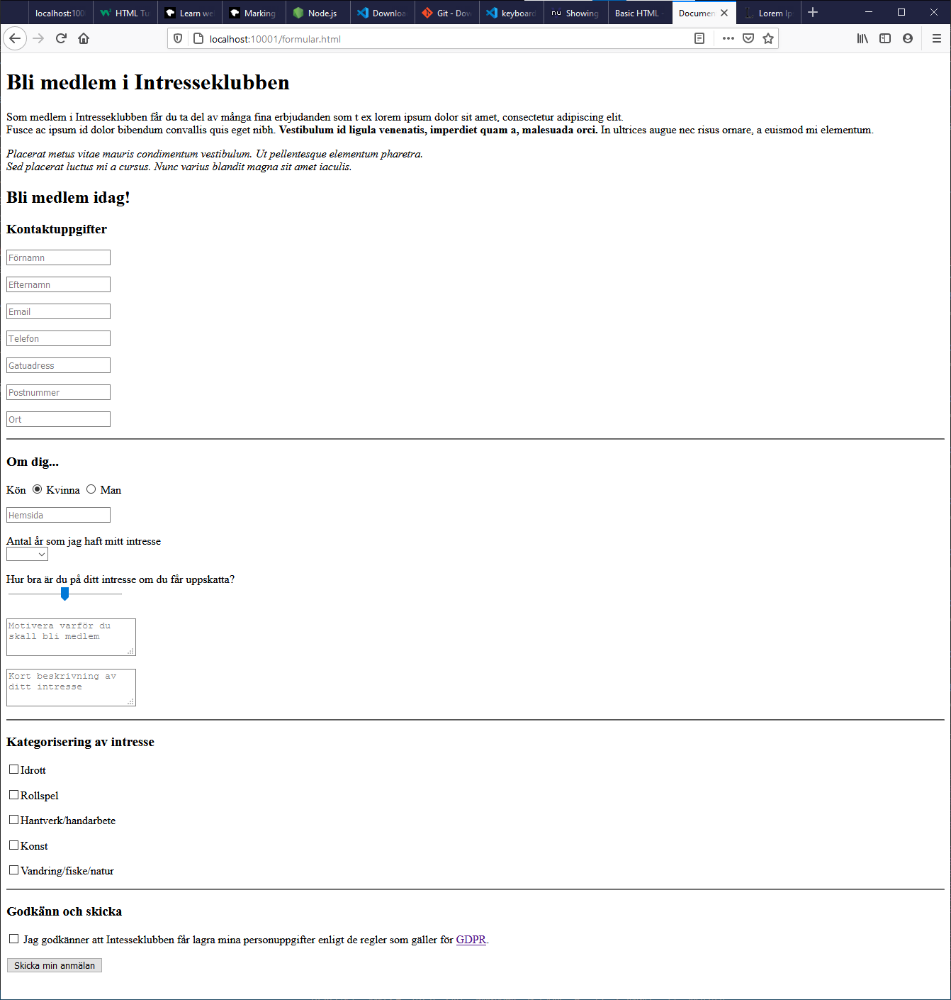

# Övning 4 - Formulär

## Setup

* Använd projektet "01 - HTML CSS" som grund/bas för denna övning.
* Kopiera mappen _"01 - HTML CSS"_ till den mapp där du har dina labbar.
* Öppna den kopierade mappen i VS Code.
* Kör kommandot `npm install` i terminalfönstret eller i en kommandoprompt (CMD). OBS! Du behöver se till att du är i rätt mapp, dvs i den kopierade mappen när du kör kommandot.
* Kör kommandot `npm start` för att starta den lokala webbservern. När den startat kommer en ny webbläsare att öppnas med adressen _localhost:10001_ eller liknande.

## Övningar

### Skapa formulär

* Skapa en ny fil som du döper till *formular.html*
* Skriv kod så att du skapar ett formulär enligt bilden nedan.

### POST

Ange följande i FORM-taggen

    <form method="POST" action="https://www.w3schools.com/action_page.php">

Detta kommer att göra att formulär-datat skickas till den angivna adressen.

