# Övning 1 - Tabeller

## Setup

* Använd projektet "01 - HTML CSS" som grund/bas för denna övning.
* Kopiera mappen _"01 - HTML CSS"_ till den mapp där du har dina labbar.
* Öppna den kopierade mappen i VS Code.
* Kör kommandot `npm install` i terminalfönstret eller i en kommandoprompt (CMD). OBS! Du behöver se till att du är i rätt mapp, dvs i den kopierade mappen när du kör kommandot.
* Kör kommandot `npm start` för att starta den lokala webbservern. När den startat kommer en ny webbläsare att öppnas med adressen _localhost:10001_ eller liknande.

## Övningar

### Skapa ny fil

* Skapa en ny fil som du döper till *tabeller.html*
* Skriv koden enligt bilden nedan.

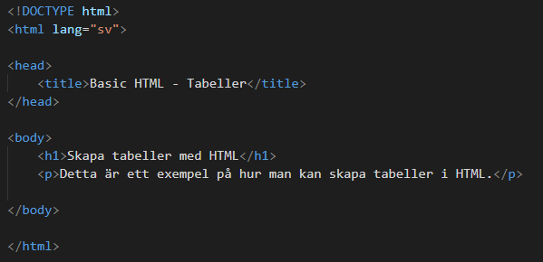

* Gå in i webbläsaren och navigera till den nya HTML-filen. Adressen borde vara något i stil med _localhost:10001/tabeller.html_  

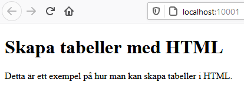

### Skapa en tabell

* Skapa en tabell genom att skriva HTML-kod enligt bilden nedan. Välj själv vilken text tabellen skall innehålla.

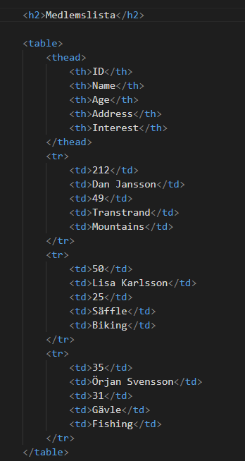

* Kontrollera i webbläsaren att det ser ut ungefär enligt bilden nedan.

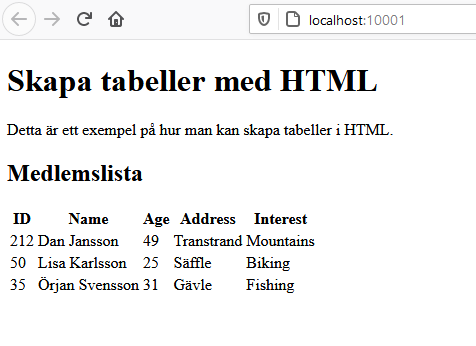

* Lägg till följande kod för att få en ram på tabellens rader och kolumner.

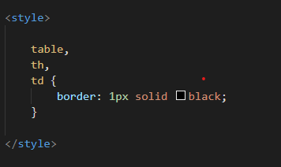

* Nu bör sidan se ut enligt nedan.

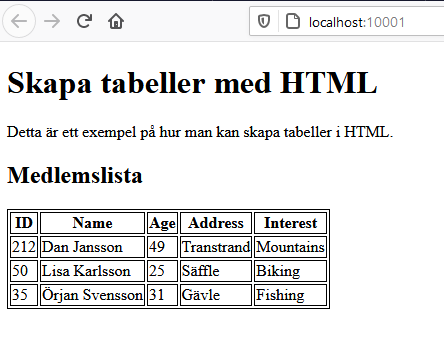

### Flytta alla stilmallar till en separat fil

* Skapa en undermapp som du döper till *styles*
* Skapa en fil i mappen _styles_ som du döper till *main.css*
* Lägg till följande kod i filen _main.css_

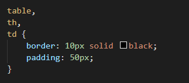

* Gå tillbaka till HTML-filen tabeller.html och ändra enligt bilden nedan för att länka in den nya filen. 

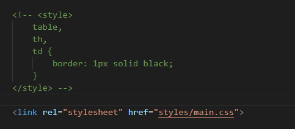

* Nu bör sidan se ut enligt nedan.

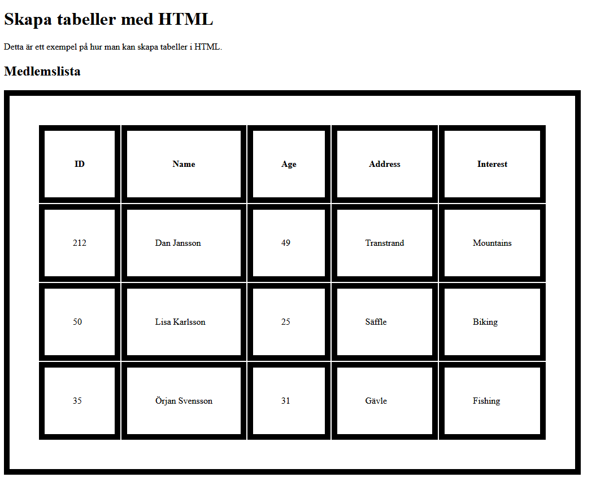

    Du har nu flyttat alla stilmallar till en separat fil vilket är det som rekommenderas när man jobbar med webbutveckling.

### Ytterligare ändringar på stilmallar

* Gå till filen main.css och ändra så att alla H1 och H2 taggar använder följande stilmallar

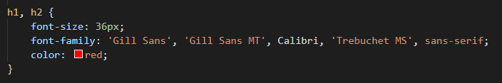

* Kontrollera i webbläsaren att det ser ut ungefär enligt bilden nedan.

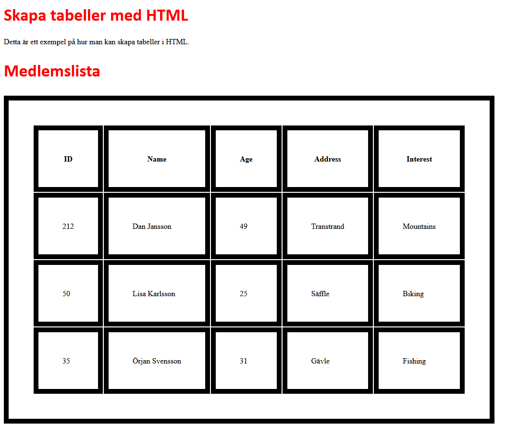

* Gör samma sak med body-taggen så att all text använder ett annat typsnitt enligt exemplet nedan

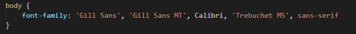

* Kontrollera i webbläsaren att det ser ut ungefär enligt bilden nedan.

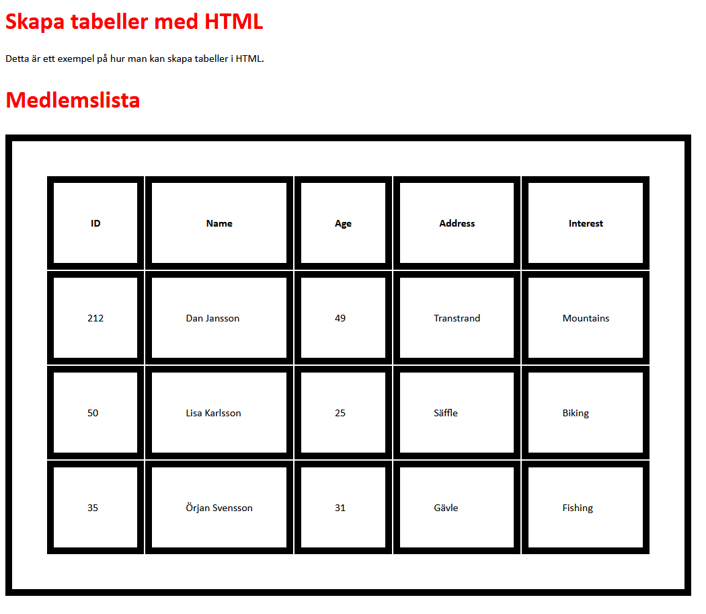
