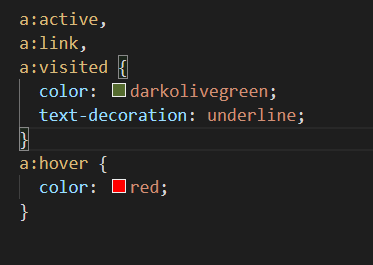

# Övning 2

## Setup

* Använd projektet "01 - HTML CSS" som grund/bas för denna övning.
* Kopiera mappen _"01 - HTML CSS"_ till den mapp där du har dina labbar.
* Öppna den kopierade mappen i VS Code.
* Kör kommandot `npm install` i terminalfönstret eller i en kommandoprompt (CMD). OBS! Du behöver se till att du är i rätt mapp, dvs i den kopierade mappen när du kör kommandot.
* Kör kommandot `npm start` för att starta den lokala webbservern. När den startat kommer en ny webbläsare att öppnas med adressen _localhost:10001_ eller liknande.

## Övningar

### Skapa ny fil

* Skapa en ny fil som du döper till *lankar.html*
* Skriv koden enligt bilden nedan.

* Gå in i webbläsaren och navigera till den nya HTML-filen. Adressen borde vara något i stil med _localhost:10001/lankar.html_  

### Skapa extern länk

* Skriv in följande kod innanför _body_-taggen

* Kontrollera att länken dyker upp i webbläsaren och klicka på den.
* Sidan bör nu öppnas i ett nytt fönster.

### Skapa intern länk

* Skapa en ny fil som du döper till *andrasidan.html*
* Skriv in följande kod i den nya filen

* Gå tillbaka till filen _lankar.html_ och skriv in följande kod under koden du skrev tidigare.

* Kontrollera att länken dyker upp i webbläsaren och klicka på den.
* Vid klick på länken bör du komma till andra sidan.
* Klicka på länken på andra sidan.
* Du bör nu vara tillbaka på huvudsidan (lankar.html).

### Använda bokmärken

* Skriv in följande kod i filen _lankar.html_ under koden du skrev tidigare.

* Gå till sidan [https://www.lipsum.com/](https://www.lipsum.com/) och skapa lite dummy-text som du sedan klistrar in mellan de två kommentarerna.
* Kontrollera att länkarna och informationen dyker upp i webbläsaren.
* Klicka på länken "botten".
* Du bör nu hamna på botten av sidan.
* Klicka på länken "toppen". Du bör nu vara tillbaka på toppen igen.

### Lägg till stilmallar för länkar

* Skapa en undermapp som du döper till *styles*
* Skapa en fil i mappen _styles_ som du döper till *main.css*
* Lägg till följande kod i filen _main.css_

* Gå tillbaka till HTML-filen _lankar.html_ och ändra enligt bilden nedan för att länka in den nya filen. 
* Gör samma ändring i filen _andrasidan.html_. 

* Nu bör sidan se ut enligt nedan.

    Du har nu flyttat alla stilmallar till en separat fil vilket är det som rekommenderas när man jobbar med webbutveckling.
