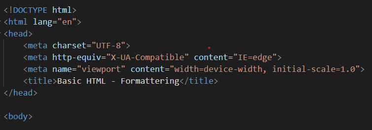
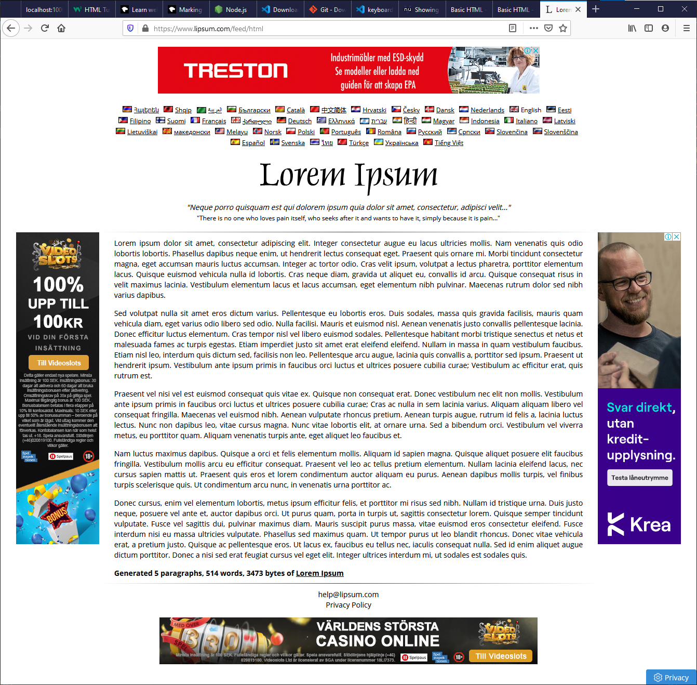
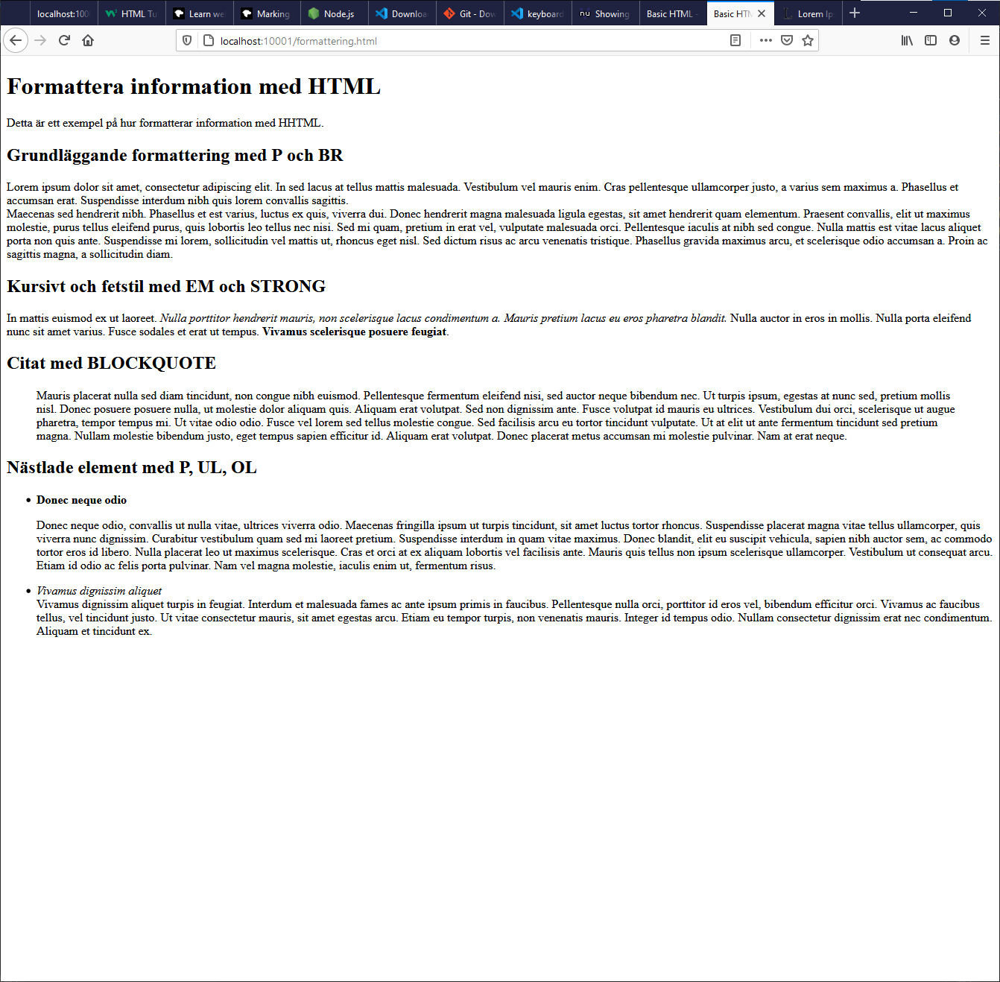

# Övning 3 - Formattering av information

## Setup

* Använd projektet "01 - HTML CSS" som grund/bas för denna övning.
* Kopiera mappen _"01 - HTML CSS"_ till den mapp där du har dina labbar.
* Öppna den kopierade mappen i VS Code.
* Kör kommandot `npm install` i terminalfönstret eller i en kommandoprompt (CMD). OBS! Du behöver se till att du är i rätt mapp, dvs i den kopierade mappen när du kör kommandot.
* Kör kommandot `npm start` för att starta den lokala webbservern. När den startat kommer en ny webbläsare att öppnas med adressen _localhost:10001_ eller liknande.

## Övningar

* Skapa en ny fil som du döper till *formattering.html*
* Skriv koden enligt bilden nedan.

### Headings

* Skapa en huvudrubrik, dvs H1 med en text du själv bestämmer.

* Gå till sidan [https://www.lipsum.com/](https://www.lipsum.com/) och skapa lite dummy-text som du sedan kommer att använda i kommande övningar.

* Skriv HTML-kod så att innehållet ser ut enligt nedan. Använd dummytexten för att skapa innehållet.

    HINT: Använd HTML-taggarna STRONG, SMALL, P, BR, BLOCKQUOTE, STRONG, EM, UL, OL, LI.

